# [Programação (LEIC.009)](https://moodle.up.pt/course/view.php?id=4881) @ [LEIC](https://paginas.fe.up.pt/~estudar/cursos/licenciatura-engenharia-informatica/)

## Introduction

This repository contains an introduction to the programming environment used in this course, which includes:

- [Using Linux](#using-linux)
- [Using the terminal](#using-the-terminal)
- [Compile and run "Hello world!" in C++](#compile-and-run-hello-world-in-c)
- [Using CMake](#using-cmake)
- [Using CLion](#using-clion)

This introduction assumes you are using the computers available at FEUP. At the end of the document you also have a [section about setting up the environment in your PC](#environment-setup).

## Using Linux

1. Make sure the lab PC boots **Linux** (shut down and restart if Windows is running).
2. Authenticate using your login and password.

## Using the terminal

### What is the command-line terminal?

A terminal lets you introduce commands that are interpreted by what is called a **command-line shell**. In this course, we will make use of it to execute programs installed in the PC.

**Outside the scope of the course**: more advanced shell commands can be used for relatively complex programming. In fact, the shell has a built-in programming language. If you wish to know more, have a look at the [Bash manual](https://www.gnu.org/software/bash/manual/bash.html) for instance.

### Launch the Terminal application

Click on **Activities** (upper-left desktop corner) then enter **Terminal** in the search bar. The **Terminal** application icon should appear. Click on it to launch a terminal.

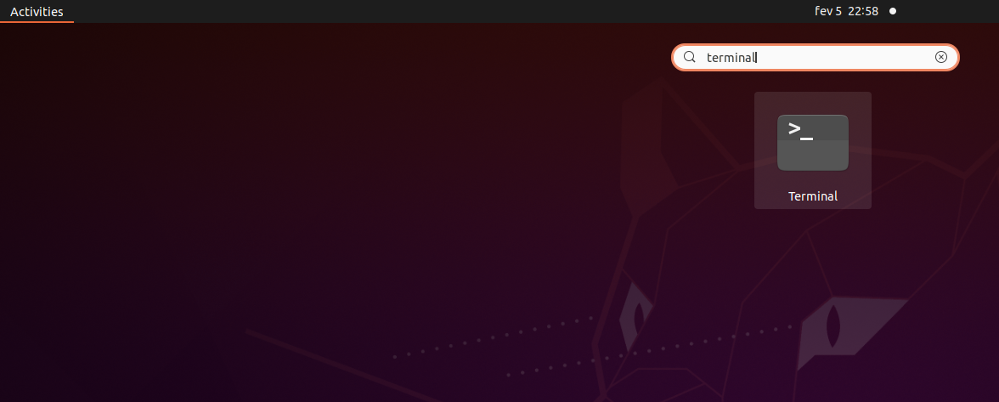

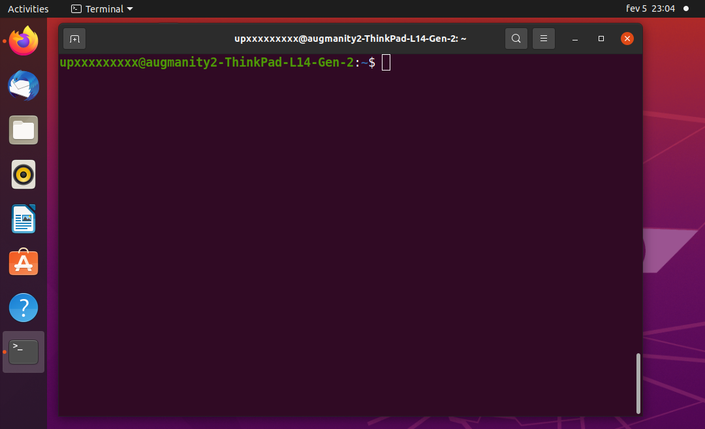

### Try a few basic commands

The sequence of commands shown below can be used to create a `prog` (sub-)directory (also known as "folder") inside `Desktop`. Note that `Desktop` is itself a sub-directory of your _home_ directory in the file system.

In a Linux terminal, usually the _home directory_ is represented as a `~`, so if you see a path that starts with `~`, this means the path starts at the _home directory_.

Other commands shown below also illustrate common file manipulations (copying, removing, etc).

In the listing, note that `$` is the symbol indicating the command prompt (it could be slightly different in your PC), and sequences starting with `#` are comments.

```bash
$ # Get current working directory
$ pwd
/home/upXXXXXXXXX
$ # List contents of current directory
$ ls
[... other files/directories may appear here ...]
Desktop
[...]
$ # Change working directory to Desktop
$ cd Desktop
$ pwd
/home/upXXXXXXXXX/Desktop
$ # Create sub-directory prog inside current working directory
$ mkdir prog
$ cd prog
$ pwd
/home/upXXXXXXXXX/Desktop/prog
$ # Create a text file named test.txt with a line
$ # containing "We will learn C++"
$ echo We will learn C++ > test.txt
$ # Check that it has been created
$ ls
test.txt
$ # See the contents of test.txt
$ cat test.txt
We will learn C++
$ # Make a copy
$ cp test.txt test2.txt
$ ls
test.txt    test2.txt
$ cat test2.txt
We will learn C++
$ # Remove test2.txt
$ rm test2.txt
$ ls
test.txt
$ # Rename test.txt to test3.txt
$ mv test.txt test3.txt
$ ls
test3.txt
$ # Now remove test3.txt making directory empty
$ rm test3.txt
$ ls
$ # Go back to Desktop directory
$ cd ..
$ pwd
/home/upXXXXXXXXX/Desktop
$ # Go back to home directory
$ cd ..
$ pwd
/home/upXXXXXXXXX
```

**Command summary**

| Command | Use for ...                                                       |
| ------- | ----------------------------------------------------------------- |
| `cat`   | showing the contents of files                                     |
| `cd`    | changing the current working directory.                           |
| `cp`    | copying files                                                     |
| `echo`  | echoing text (example above redirects output to a file using `>`) |
| `ls`    | listing the contents of a directory                               |
| `mkdir` | creating a directory                                              |
| `mv`    | renaming / moving files                                           |
| `pwd`   | printing the current working directory                            |
| `rm`    | removing files                                                    |

For reference and further examples of these and other commands, you may check a number of references online, for instance:

- [SS64.com - An A-Z Index of the Linux command line: bash + utilities](https://ss64.com/bash/)
- [LinuxHandbook.com - A to Z Linux Commands](https://linuxhandbook.com/a-to-z-linux-commands/)

If you want to learn more about the command line, there is a tutorial available from Ubuntu: [The Linux command line for beginners](https://ubuntu.com/tutorials/command-line-for-beginners#1-overview).

## Compile and run "Hello world!" in C++

### Get the necessary files

Download these two files:

1. [`hello.cpp`](https://raw.githubusercontent.com/progleic/prog2425_setup/refs/heads/main/hello.cpp): the C++ source code of the "Hello world!" program
2. [`CMakeLists.txt`](https://raw.githubusercontent.com/progleic/prog2425_setup/refs/heads/main/CMakeLists.txt): CMake build file for compilation.

Usually the files will be downloaded automatically to the `Downloads` directory.
You can copy them to the `prog` directory you created in previously (**step 2**) using `cp`.

```bash
$ # "cd" with no arguments: working directory set to home directory
$ cd
$ pwd
/home/upXXXXXXX
$ cp Downloads/hello.cpp Downloads/CMakeLists.txt Desktop/prog
$ ls Desktop/prog
hello.cpp CMakeLists.txt
```

### The source code

The `hello.cpp` file contains the C++ source code of a program that prints "Hello world!":

```cpp
/*
 A program that prints "Hello world!".
*/
#include <iostream>

int main() {

  // Print the message
  std::cout << "Hello world!\n";

  return 0;
}
```

This example gives you a first impression of C++ syntax:

- **Comments** may be multi-line, beginning with `/*` and ending with `*/`, as in

  ```cpp
  /*
  A program that prints "Hello world!".
  */
  ```

  or single-line, beggining with `//`, as in

  ```cpp
  // Print the message
  ```

- Code indentation (using spaces, line breaks, tabs) **has no semantic meaning**, as in Python. Programs should be well indented for readability, though!

- The `#include` directive

  ```cpp
  #include <iostream>
  ```

  is required to import some C++ definitions related
  to I/O, and is roughly similar to a Python `import` statement. Definitions in the `<iostream>` include are in the `std` namespace, we will need to refer to it when using those definitions.
  Later in the course we will cover these directives in more detail.

- `main` is the program entry **function** with a body of instructions between `{` and `}`. Individual instructions are terminated with a semi-colon (`;`), as in

  ```cpp
  std::cout << "Hello world!\n";
  return 0;
  ```

- The "Hello world!" message is printed by

  ```cpp
  std::cout << "Hello world!\n";
  ```

  where `std::cout` identifies the standard output stream
  of the program, and `"Hello world!\n"` is the string to print.

  `<<` is the left-shift operator, but in this context represents the stream insertion operator (the same way `+` in Python can mean to add or concatenate, depending on the types of the operands),

  Notice that since the definition `cout` is in the namespace `std`, to refer to it we need to use `std::cout`.

- As you may note, `main` returns `0`. This is just a standard convention: `0` tells the operating system that the program executed successfully without errors. When there are errors, a program should return a value different than `0` (e.g., `-1`).

### Compile the program using GCC

**To run the "Hello world!" program you need to compile it first**, that is, to generate an executable file containing binary machine instructions from the source code. This can be done using the GCC C++ compiler, that is, the `g++` program:

```bash
$ cd Desktop/prog
$ cat hello.cpp      # will show the contents above
[...]
$ # Compile the program
$ g++ hello.cpp -o hello
$ ls
Makefile hello hello.cpp
```

The execution above of `g++ hello.cpp -o hello` compiles the C++ source code in `hello.cpp` to an executable file called `hello` (with no extension). We can now run the executable file ...

```bash
$ ./hello
Hello world!
```

Note: Compiling C++ code can be complex and on some setups, compiling by hand with this simple command might not work. For instance, if you are on Windows and using the MSYS version of the Clang compiler, you might need to add the flag `-lstdc++` to be able to compile. In the next section we will present a more robust way of compiling C++ code.

## Using CMake

### Introduction to CMake

Due to C++'s complex and diverse history, it has a very fragmented build automation landscape.
So, unlike many modern programming languages that standardize around a single build system, the C++ ecosystem has a variety of tools, approaches, and practices.

One of the first of these tools is `make`, a command-line utility for building programs according to configurations defined in a text file usually called `Makefile`. However, this is just one of the several possible tools, and is currently considered to be a very low-level build system, requiring a lot of manual effort from the programmer.

**CMake** is what is considered a _meta-build tool_, which means that instead of directly compiling code, CMake will generate the build files for a variety of build systems. In FEUP PCs, when we run CMake throught the terminal, it will generate by default a `Makefile` to be run with the command `make`.

Compiling C++ code can generate many temporary files, and to avoid poluting the source folder with these files, developers employ what is usually called **out-of-source builds**. This is simply having a separate subfolder for the compilation, usually called `build`, where the temporary files will be written.

### First CMake project

Modern compilation flows are based around a build file, that indicates which source files, dependencies and compilation options (among other things) are needed to compile a program.

CMake projects always have in their root folder a file with the name `CMakeLists.txt`, which contains all the information needed to build the program.

To compile your program using CMake, make sure the file [`CMakeLists.txt`](CMakeLists.txt) is in the `prog` directory (recall the [step above](#compile-the-program-using-gcc)) and remove the `hello` executable file, if you created it. The first step will be to generate the `Makefile` that will compile your code inside a `build` subfolder:

```bash
$ # Remove the executable just to make sure
$ rm hello
$ ls
hello.cpp CMakeLists.txt
$ # Create a build folder
$ mkdir build
$ # Go inside the build folder
$ cd build
$ # Generate the Makefile, you have to provide as input the folder
$ # that contains the file CMakeLists.txt
$ cmake ..
$ # Compile the program using make
$ make hello
[ 50%] Building CXX object CMakeFiles/hello.dir/hello.cpp.obj
[100%] Linking CXX executable hello
[100%] Built target hello
$ # Execute the program as before
$ ./hello
Hello world!
$ # make won't recompile if the source code file does not change
$ make hello
[100%] Built target hello
```

_Tip:_ You can tell CMake to create the `build` subfolder by using the flag `-B`, i.e., `cmake -B build`. Note that since you are in the folder with the file `CMakeLists.txt`, you do not need to indicate the folder (`..` in the previous example). Also, you will still need to enter the `build` folder before calling `make` (i.e., `cd build`).

You only need to call CMake once, to generate the build file. After that first call, you will be using the commands for the build tool that was generated (`make`, in this case).

Also, `make` will only trigger a program compilation if there are source code changes more recent than the corresponding executable's compile time, as illustrated above for the output of the second `make hello` command, which immediately says that the target is built.

The given file `CMakeLists.txt` customises C++ compilation with various options,
e.g., `-std=c++17` sets the use of the C++ 2017 language standard. Check the [information available at the setup section](#compiler-settings-and-their-meaning) for details on the meaning of each option used.
Bear in mind that **these same options will be configured in Moodle's automated code correction plugin (CodeRunner)** throughout the semester. Failing to use the given `CMakeLists.txt` may lead to different behavior in program compilation or execution.

### Modifying the `CMakeLists.txt` file

If you want to create your own programs, you can use this [`CMakeLists.txt`](CMakeLists.txt) as a base.

_Tip_: Remove the line `add_executable(hello hello.cpp)` if you want to remove the compilation of that program from your build file.

To compile program `x` with source code `x.cpp` you have to add an `add_executable` command in the `CMakeLists.txt` file:

```cmake
# ...other commands
add_executable(x x.cpp)
```

This will enable the comand `make x` after running `make` at least once after the changes (or when running the `cmake` command):

```bash
$ make
-- Configuring done (0.2s)
-- Generating done (0.0s)
-- Build files have been written to: /home/upxxxxxxxxx/prog/build
[ 50%] Built target hello
[ 75%] Building CXX object CMakeFiles/x.dir/x.cpp.obj
[100%] Linking CXX executable x.exe
[100%] Built target x
$ make x
[100%] Built target x
```

To compile a program with several sources, specify the required files in the `add_executable` command:

```cmake
add_executable(hello_again hello_again.cpp say_hello.cpp)
```

_Tip_: The first argument of `add_executable` is the name of the program, and can be different from the name of the source files.

If the program requires header files (i.e., files with extension .h), after you declare the program (i.e., `hello_again`) with the `add_executable` command, you can use the command `target_include_directories`:

```cmake
target_include_directories(hello_again PUBLIC include)
```

`include` is the path to the folder with the header files, relative to the `CMakeLists.txt` file, and `PUBLIC` is a keyword specifying the scope of the include (could be `INTERFACE`, `PUBLIC` or `PRIVATE`, for more details you can check [here](https://cmake.org/cmake/help/latest/command/target_include_directories.html)).

## Using CLion

### Launch CLion

Use the **Activities** search bar to look for CLion. Then launch it.

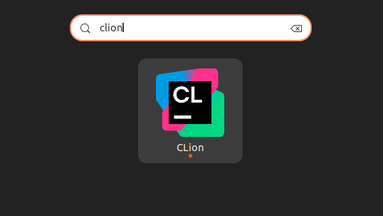

### (Optional) Import settings

If asked if you want to import settings, you can skip it.

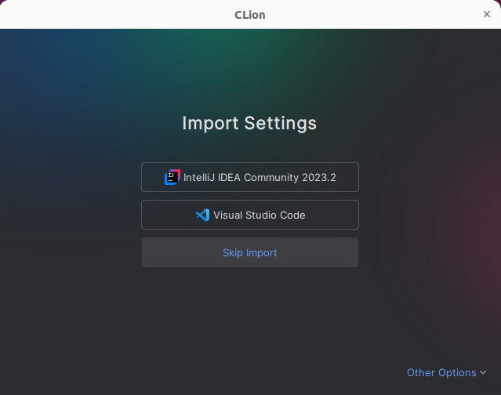

### Open project

If no project is open, you can choose the option in the middle, _Open_ (first image). Otherwise, from the menu choose **File > Open...**. In both cases, select the `Desktop/prog` directory used in previous steps (second image). CLion projects are based on CMake, so you have to indicate a directory that contains a `CMakeLists.txt` file. Notice that if a directory contains a `CMakeLists.txt` file, it will have a black box icon, representing a terminal.

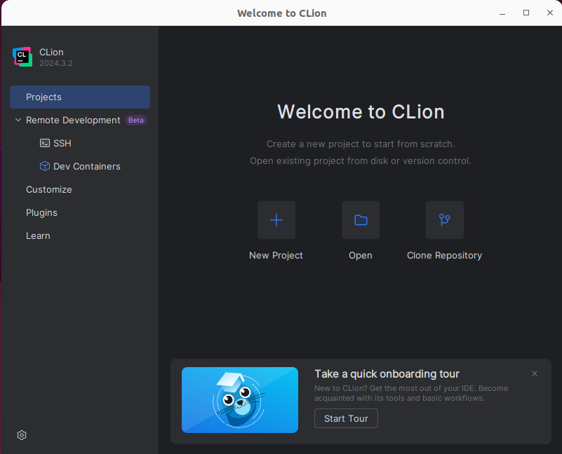

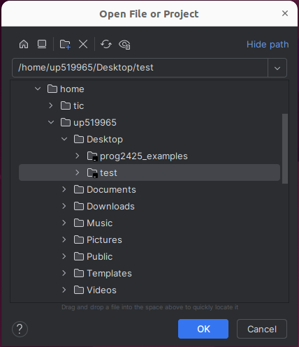

If it asks to trust the project, you can say yes.

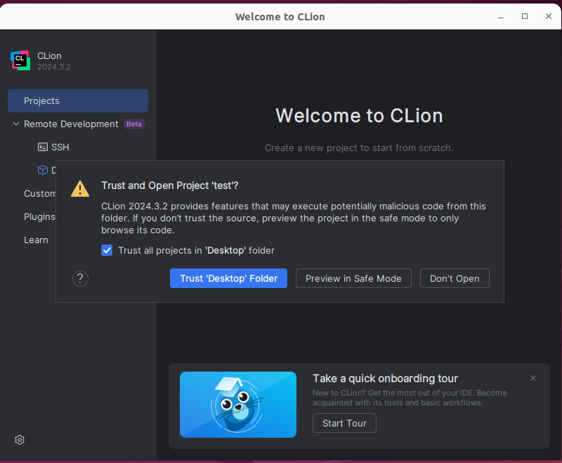

### Build environment

If it is the first time launching CLion, it may ask to configure the build environment. CLion has a bundled build environment for C/C++ compilation, you can choose _Skip Wizard and Use Defaults_.

Note that by default, CLion might use Ninja instead of Makefile as the build tool. Ninja is just another build tool, more recent that Makefile, and more adequate for meta-build tools such as CMake.

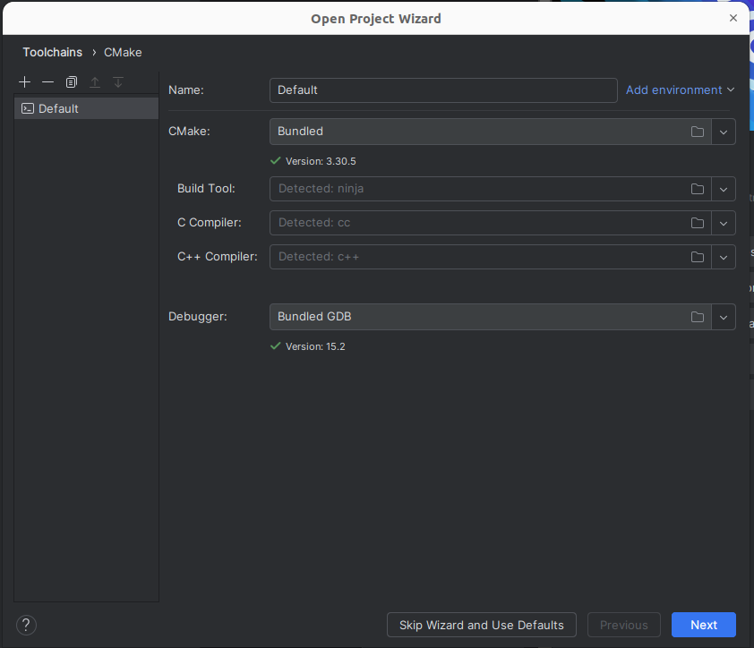

### Inspect files and source code

You may now browse your project contents and have an editor window for
source code.

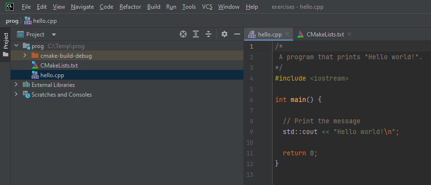

### Launch program

After the build process finishes in the background, and assuming there are no compilation erros, if your project has a source file with a `main()` function, there should appear an arrow next to it. Click it and choose `Run 'hello'` to launch the program called _hello_. The output will appear below.

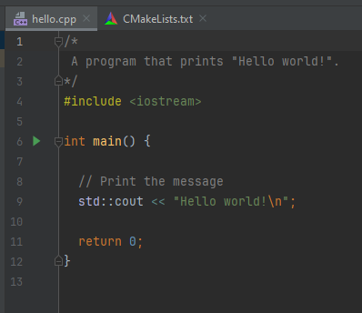

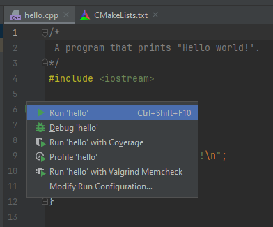

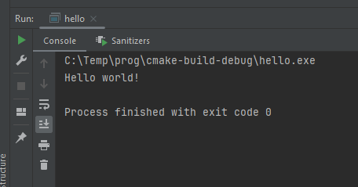

### Create a new program

Let us create another C++ program with the
following code:

```cpp
#include <iostream>

int main() {
  int value;
  std::cin >> value;
  std::cout << "The value you entered was: " << value << "!\n";
  return 0;
}
```

This program reads an integer value input by the user and then prints it.

In CLion you can create and run the new program by editing the file `CMakeLists.txt` as follows:

- Access **File > New > C/C++ Source File**.
- Give a name to the file (e.g., `enter_value.cpp`) and uncheck **Add to targets**.
- Copy the C++ code above to the editor tab for the new file.
- Open the file `CMakeLists.txt` and add the line `add_executable(enter_value enter_value.cpp)`. If the icon below appears, click it, it will refresh the project.

  

- Go to the file `enter_value.cpp`, click the green arrow next to the main function and \*_Run 'enter_value'_ to run the new program.

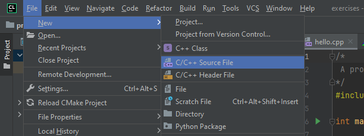

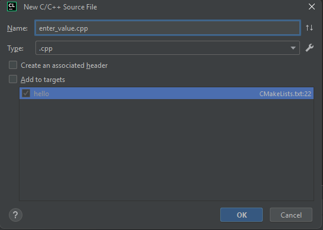

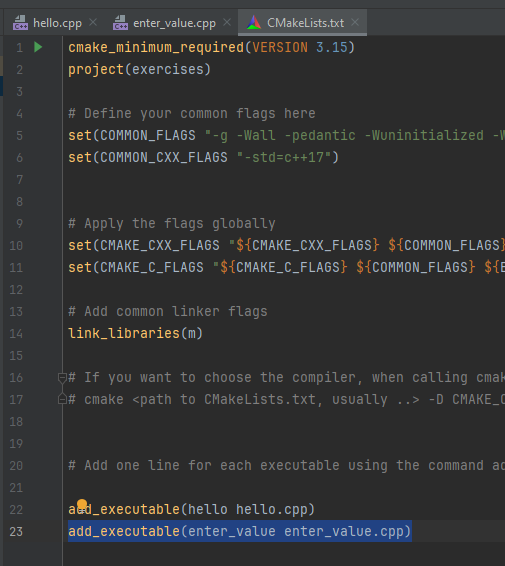

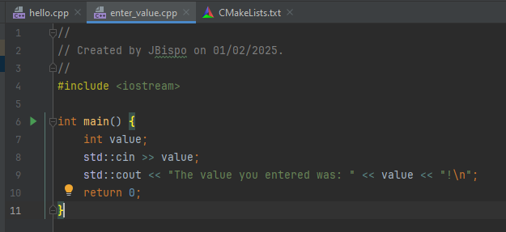

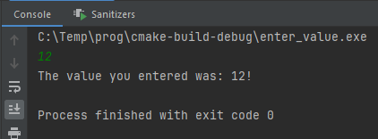

## Environment Setup

### Basic requirements

1. Linux or Linux-compatible environment.
2. Required installation: [GCC](https://gcc.gnu.org) (C/C++ compiler), [Make](https://www.gnu.org/software/make/) (build tool) and [CMake](https://cmake.org/) (meta-build tool).
3. Optional (but recommended): [GDB](https://www.sourceware.org/gdb/) (C/C++ debugger).
4. [CLion](https://www.jetbrains.com/clion) IDE.

**All these tools are installed in FEUP's labs running Linux.**

### Compilation settings

#### Compiler settings and their meaning

(according to `CMakeLists.txt` contents)

| Option                                    | Meaning                                                                                                                                                                                          |
| ----------------------------------------- | ------------------------------------------------------------------------------------------------------------------------------------------------------------------------------------------------ |
| `-std=c++17` `-pedantic`                  | Set C++ 2017 as the language standard, and enforce it strictly.                                                                                                                                  |
| `-Wall -Wuninitialized -Werror`           | Generate all standard warnings, warnings for uninitialized variables, and treat warnings as compilation errors.                                                                                  |
| `-g`                                      | Generate executable with debug symbols, suitable for use with GDB.                                                                                                                               |
| `link_libraries(m)` (or `-lm`)            | Link with math library.                                                                                                                                                                          |
| `-fsanitize=address -fsanitize=undefined` | Enable the use of [AddressSanitizer](https://github.com/google/sanitizers/wiki/AddressSanitizer) and [Undefined Behavior Sanitizer](https://clang.llvm.org/docs/UndefinedBehaviorSanitizer.html) |

## Development environment for your PC

#### Linux

##### Installing Linux

There are several Linux distributions, e.g., [Ubuntu](https://ubuntu.com/tutorials/install-ubuntu-desktop#1-overview) as in FEUP's labs.

##### Package installation

Package [`build-essential`](https://packages.ubuntu.com/focal/build-essential) contains GCC and Make. On Ubuntu for instance, this package can be installed as follows:

```bash
sudo apt install build-essential
```

To install CMake execute:

```bash
sudo apt install cmake
```

To install GDB as well, execute:

```bash
sudo apt install gdb
```

#### Windows

##### Windows Subsystem for Linux (WSL) - RECOMMENDED

Use the [Windows Subsystem for Linux (WSL)](https://docs.microsoft.com/en-us/windows/wsl/about), which you can see how to install [here](https://learn.microsoft.com/en-us/windows/wsl/).

WSL will provide you with a _"GNU/Linux environment -- including most command-line tools, utilities, and applications -- directly on Windows, unmodified, without the overhead of a traditional virtual machine or dualboot setup"_.

If you configure WSL to run Ubuntu, then you may install GCC, CMake and GDB as illustrated previously for (standalone) Linux;
simply run the following commands in the WSL command line:

```bash
sudo apt install build-essential
sudo apt install cmake
sudo apt install gdb
```

**Warning**: File access in WSL directly from Windows folders (instead of WSL native folders) is extremely slow. For the purposes of this course it might be ok though. However, if you are having perfomance problems, consider accessing files from native WSL folders (i.e., that do not have a path such as `/mnt/c/...`).

##### Alternative - Linux VM image

Use [Virtual Box](https://www.virtualbox.org/) for running a Linux VM,
e.g., check this [guide for Ubuntu](https://ubuntu.com/tutorials/how-to-run-ubuntu-desktop-on-a-virtual-machine-using-virtualbox#1-overview).

##### Alternative - MSYS/MinGW

The previous solutions will generate Linux executables. To generate native Windows executables you will need a Windows compiler. The default Windows C++ compiler is **MSVC** (Microsoft C++ Compiler), however its build environment and tooling is very different from the Linux environment presented here.

To be able to build native Windows applications using a Linux-like environment you can use **MinGW** (Minimalist GNU for Windows) together with **MSYS** (Minimal SYStem).

MinGW provides a collection of build tools, similar to what you get from `build-essentials`, but compiled natively for Windows.

MSYS provides a lightweight POSIX-like command-line environment, similar to `bash`, and enables running build scripts and tools originally designed for Linux systems, but natively on Windows.

Installation of this environment is out-of-scope for this course, but MSYS provides an [easy-to-use installer](https://www.msys2.org/).

**Warning**: The flags `-fsanitize=address` and `-fsanitize=undefined` do not work with the default C++ compilers of MinGW. If you want to keep those flags in a MinGW build environment, you have to use a special version of `clang` (another open-source C++ compiler), `g++` will not work.

To install the `clang64` version in MinGW use the command `pacman -S mingw-w64-clang-x86_64-clang`. When compiling (or generating the build files with CMake), make sure that the executable that is used is `/clang64/bin/clang`. The default executable `/mingw64/bin/clang` will not support the sanitization flags.

#### MacOS

#### GCC and GDB using Homebrew - RECOMMENDED

Install GCC and GDB using the [Homebrew package manager](https://brew.sh/).

- [GCC](https://formulae.brew.sh/formula/gcc#default)
- [GDB](https://formulae.brew.sh/formula/gdb#default) - you also need to follow the [complementary steps for code-signing GDB](https://sourceware.org/gdb/wiki/PermissionsDarwin)

##### Alternative - use clang

[XCode](https://developer.apple.com/xcode/) includes the [clang C/C++ compiler](https://clang.llvm.org/) that has the same command-line switches as gcc. The [LLDB debugger](https://lldb.llvm.org/) is also an alternative to GDB.

Some necessary features may be missing from XCode's version of clang, however.
The [LLVM clang version configured through Homebrew](https://formulae.brew.sh/formula/llvm#default) should work better.

##### Alternative - Linux VM image

Check the instructions given for Windows and VirtualBox above.

#### CLion setup

**Note**: CLion already includes some tools, such as CMake or GDB, but you will need to install the C/C++ compiler and the build tool (e.g., Makefile). Install first the needed tools described above.

Steps:

- Get a [JetBrains Education License](https://www.jetbrains.com/community/education/#students/)
- Download and install [CLion](https://www.jetbrains.com/clion/)
